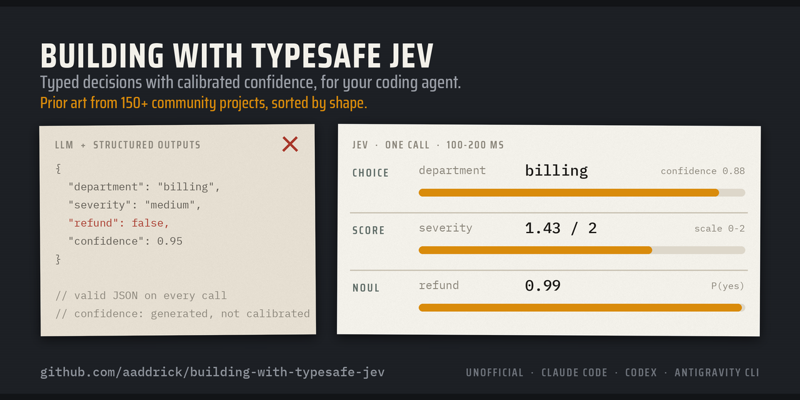

<p align="center">
  
</p>

<p align="center">
  <strong>Building with TypeSafe Jev</strong><br>
  <em>为你的编程智能体提供带校准置信度的类型化决策。</em><br>
  <em>来自 150 多个社区项目的先例，按形态分类。</em>
</p>

<p align="center">
  <a href="../../LICENSE"></a>
  <a href="../workflows/checks.yml"></a>
</p>

<p align="center">
  <a href="https://www.linkedin.com/in/aaddrick/">在 LinkedIn 上联系我！</a>
</p>

<p align="center">
  <a href="../../README.md">English</a> ·
  <strong>简体中文</strong> ·
  <a href="README.ja.md">日本語</a> ·
  <a href="README.ko.md">한국어</a> ·
  <a href="README.vi.md">Tiếng Việt</a> ·
  <a href="README.pt-BR.md">Português (BR)</a> ·
  <a href="README.it.md">Italiano</a> ·
  <a href="README.en-x-aibro.md">AI Bro</a>
</p>

> [!NOTE]
> 这是一个非官方的社区技能。它不是由 TypeSafe AI 制作、审核或认可的。TypeSafe 在 [typesafe-ai/skills](https://github.com/typesafe-ai/skills) 发布了自己的技能。参见[与官方技能的区别](#与官方技能的区别)。

编程智能体把 Jev 当作又一个聊天模型。这个技能教它们为 Jev 做设计：类型化的问题、校准过的置信度，以及一个收录 150 多个社区项目、按工作方式分类的库。它可以安装在 Claude Code、Codex 和 Antigravity CLI 中。

## 安装

<details>
<summary><strong>Claude Code</strong></summary>

在终端里运行这两条命令：

```bash
claude plugin marketplace add aaddrick/building-with-typesafe-jev
```

```bash
claude plugin install building-with-typesafe-jev@building-with-typesafe-jev
```

你在写 Jev 代码时，技能会自动加载。想手动加载，输入：

```
/building-with-typesafe-jev:building-with-typesafe-jev
```

安装时可能会提示某个插件选项尚未设置。那是实时测试，在你开启之前它一直是关闭的。参见[设置 API 密钥](#设置-api-密钥可选推荐)。

</details>

<details>
<summary><strong>Codex</strong></summary>

```bash
codex plugin marketplace add aaddrick/building-with-typesafe-jev
```

```bash
codex plugin add building-with-typesafe-jev@building-with-typesafe-jev
```

开启一个新线程。任务匹配时，Codex 会加载这个技能。想手动加载，输入：

```
$building-with-typesafe-jev:building-with-typesafe-jev
```

</details>

<details>
<summary><strong>Antigravity CLI</strong></summary>

```bash
agy plugin install https://github.com/aaddrick/building-with-typesafe-jev
```

检查是否已安装：

```bash
agy plugin list
```

开启一个新会话。任务匹配时，Antigravity CLI 会加载这个技能。想手动加载，输入：

```
/building-with-typesafe-jev:building-with-typesafe-jev
```

从 Gemini CLI 迁移过来？如果 `agy plugin import gemini` 已经导入了这个扩展，也请运行上面的安装命令。它会替换导入的副本，那个副本的设置命令在 Antigravity CLI 中无法使用。

</details>

<details>
<summary><strong>其他任何能读取 SKILL.md 的智能体</strong></summary>

把 `skills/building-with-typesafe-jev/` 文件夹复制到你的智能体的技能文件夹里。保留整个文件夹。`SKILL.md` 会链接到它旁边的文件。

</details>

## 设置 API 密钥（可选，推荐）

没有密钥，这个技能也能用。它照样会选择原语、写出问题和代码，并对照它的 API 参考进行检查。有了密钥，它还会在代码进入你的项目之前，用真实的 API 调用测试每个设计。这样能发现写错的字段名，以及 Jev 的理解与你本意不同的问题。每次调用的费用不到一美分，所以我们强烈建议配置密钥。

实时测试在你开启之前是关闭的。关闭时，这个技能从不查找密钥。开启后，它只从你指定的环境变量读取密钥（默认是 `TYPESAFE_API_KEY`，除非你另选一个），在第一次调用前告诉你，并且每个任务只做大约 10 次测试调用。一共三步：创建密钥、保存密钥、开启实时测试。

<details>
<summary><strong>创建密钥</strong>（在 TypeSafe 控制台中分四步完成）</summary>

**第 1 步。** 登录 [console.typesafe.ai](https://console.typesafe.ai/)，在侧边栏中打开 **API Keys**（API 密钥）。


**第 2 步。** 点击右上角的 **Create key**（创建密钥）。


**第 3 步。** 按密钥的使用位置给它命名，比如机器名或智能体名。然后点击 **Create key**（创建密钥）。


**第 4 步。** 现在就复制密钥。控制台只显示一次。如果弄丢了，就新建一个，并撤销旧的。


</details>

<details>
<summary><strong>保存密钥</strong>（macOS、Linux、Windows）</summary>

把密钥放在单独的文件里，并且只有你能读取。这个技能从环境变量读取密钥，从不读取文件，所以这个变量必须在智能体启动的 shell 中已经设置好。智能体经常在没有终端的情况下启动 shell，所以每一节都会把密钥放在这些 shell 能看到的地方。选择你的系统。

<details>
<summary><strong>macOS</strong>（zsh，默认 shell）</summary>

把密钥保存到私有文件：

```bash
mkdir -p ~/.config/typesafe && umask 077 && printf 'export TYPESAFE_API_KEY=%s\n' 'YOUR_KEY' > ~/.config/typesafe/env
```

从 `~/.zshenv` 加载它。每个 zsh 都会读取这个文件，包括智能体在没有终端时启动的 shell。`~/.zshrc` 只会被交互式 shell 读取。

```bash
echo '[ -f ~/.config/typesafe/env ] && . ~/.config/typesafe/env' >> ~/.zshenv
```

打开一个新终端检查一下。这条命令打印的是密钥的长度，而不是密钥本身：

```bash
echo ${#TYPESAFE_API_KEY}
```

</details>

<details>
<summary><strong>Linux 使用 bash</strong>（Ubuntu、Debian、Mint、Fedora、Arch）</summary>

把密钥保存到私有文件：

```bash
mkdir -p ~/.config/typesafe && umask 077 && printf 'export TYPESAFE_API_KEY=%s\n' 'YOUR_KEY' > ~/.config/typesafe/env
```

在 `~/.bashrc` 的**顶部**加载它。Ubuntu、Debian、Mint 和 Arch 的 `~/.bashrc` 开头有一行，会在没有连接终端时提前退出。写在这道检查下面的行永远不会为智能体的 shell 执行。文件顶部在每个发行版上都是安全的：

```bash
sed -i '1i [ -f ~/.config/typesafe/env ] \&\& . ~/.config/typesafe/env' ~/.bashrc
```

打开一个新终端检查一下：

```bash
echo ${#TYPESAFE_API_KEY}
```

</details>

<details>
<summary><strong>Linux 使用 zsh</strong></summary>

按照 macOS 的步骤操作。zsh 在 Linux 上也以同样的方式读取 `~/.zshenv`。

</details>

<details>
<summary><strong>Linux 使用 fish</strong></summary>

fish 会读取 `~/.config/fish/conf.d/` 中的每个文件，无论有没有终端：

```fish
mkdir -p ~/.config/fish/conf.d; and echo 'set -gx TYPESAFE_API_KEY YOUR_KEY' > ~/.config/fish/conf.d/typesafe.fish; and chmod 600 ~/.config/fish/conf.d/typesafe.fish
```

```fish
string length -- $TYPESAFE_API_KEY
```

</details>

<details>
<summary><strong>Windows</strong>（PowerShell）</summary>

把密钥保存为用户环境变量。新打开的终端和应用能看到它，已经打开的终端看不到：

```powershell
[Environment]::SetEnvironmentVariable('TYPESAFE_API_KEY', 'YOUR_KEY', 'User')
```

打开一个新终端检查一下：

```powershell
$env:TYPESAFE_API_KEY.Length
```

**WSL：** 默认情况下，Windows 变量不会传到 WSL 中。在 WSL 里，请按照 Linux 使用 bash 的步骤操作。

</details>

<details>
<summary><strong>桌面应用和 IDE 扩展</strong></summary>

从程序坞、开始菜单或桌面启动器打开的应用不会读取你的 shell 文件。

- **Windows：** 上面设置的用户环境变量已经覆盖了这些应用。
- **Linux（systemd）：** 把 `TYPESAFE_API_KEY=YOUR_KEY` 这一行加入 `~/.config/environment.d/typesafe.conf`，然后注销并重新登录。
- **macOS：** 从终端启动应用，或者在应用自己的设置中设置这个变量。macOS 没有简单的、桌面应用会读取的按用户配置文件。

</details>

</details>

<details>
<summary><strong>开启实时测试</strong>（Claude Code、Codex、Antigravity CLI）</summary>

每个智能体都保存两项设置：实时测试（`on` 或 `off`，默认 `off`），以及存放密钥的变量名（默认 `TYPESAFE_API_KEY`）。设置一次即可，从下一个会话开始生效。辅助脚本需要 Python 3；Codex 的脚本需要 3.11 或更高版本。

**Claude Code。** 在终端里运行：

```bash
claude plugin install building-with-typesafe-jev@building-with-typesafe-jev --config live_testing=on
```

如果你的密钥放在另一个名字的变量里，加上 `--config key_env_var=YOUR_VARIABLE`。在会话中，`/plugin configure building-with-typesafe-jev@building-with-typesafe-jev` 可以修改同样的设置。

**Codex。** Codex 没有插件设置，所以技能把设置保存在 `~/.codex/config.toml` 中，Codex 会把它传给智能体启动的每个 shell。在会话中输入：

```
$building-with-typesafe-jev:jev-settings live on
```

Codex 会请求批准这次写入。想手动修改，把这几行加入 `~/.codex/config.toml`：

```toml
[shell_environment_policy.set]
JEV_LIVE_TESTING = "on"
JEV_KEY_ENV_VAR = "TYPESAFE_API_KEY"
```

Codex 还会要求你信任一次插件的会话启动钩子。每次会话开始时，这个钩子会告诉智能体实时测试是否开启、存放密钥的变量是否已设置，但绝不会透露密钥本身。在会话中输入 `/hooks` 并信任它。更新改动了钩子时，Codex 会再次询问。在你信任之前，钩子不会运行，技能仍会自己检查设置。

**Antigravity CLI。** Antigravity CLI 没有插件设置，但智能体的 shell 会继承启动 `agy` 的终端的环境。所以这两项设置就是两个环境变量，写在你存放密钥的地方。如果密钥在 `~/.config/typesafe/env` 中，运行下面的命令，然后打开一个新终端并重启 `agy`：

```bash
echo 'export JEV_LIVE_TESTING=on' >> ~/.config/typesafe/env
```

如果你的密钥在另一个名字的变量里，用同样的方法加上 `export JEV_KEY_ENV_VAR=YOUR_VARIABLE`。在 fish 或 Windows 上，按你存放密钥的方式把 `JEV_LIVE_TESTING` 设为 `on`。

**检查一下。** 开启一个新会话，运行设置命令：Claude Code 中是 `/building-with-typesafe-jev:jev-settings`，Codex 中是 `$building-with-typesafe-jev:jev-settings`，Antigravity CLI 中是 `/building-with-typesafe-jev:jev-settings`。它会显示两项设置，以及智能体的 shell 能否看到密钥。它打印的是密钥的长度，而不是密钥本身。

**CI 和容器。** 环境变量 `JEV_LIVE_TESTING` 和 `JEV_KEY_ENV_VAR` 在每个智能体中都会覆盖已保存的设置。

</details>

<details>
<summary><strong>如果智能体看不到密钥</strong></summary>

当智能体的 shell 中没有这个变量时，设置命令会显示 `key: not set in this shell`。按顺序检查以下几项：

- **你在保存密钥之前就启动了智能体。** 智能体的 shell 会复制启动它的程序的环境。退出智能体，然后从一个新终端启动它。
- **你从程序坞、开始菜单或 IDE 启动了智能体。** 这些应用不会读取你的 shell 文件。参见上面的"桌面应用和 IDE 扩展"。
- **Codex 过滤了环境变量。** 如果 `~/.codex/config.toml` 在 `[shell_environment_policy]` 下设置了 `include_only`，把你的密钥变量、`JEV_LIVE_TESTING` 和 `JEV_KEY_ENV_VAR` 加进去。如果它设置了 `ignore_default_excludes = false`，Codex 会丢弃名字中带有 `KEY` 的所有变量。删掉那一行。
- **WSL。** Windows 变量不会传到 WSL 中。按照 Linux 的步骤在 WSL 里保存密钥。

</details>

这个技能永远不会打印、记录或硬编码密钥。它只读取你指定的变量，并把密钥交给每条测试命令，而不会把密钥放在命令行上。

## 它做什么

LLM 可以返回 JSON，用上 Structured Outputs 后，JSON 每次都能解析。但它仍然可能出错，而输出里没有任何东西告诉你它出错的频率。schema 固定的是答案的形状，而不是答案本身。不管模型是知道还是在猜，部门字段都会写"billing"。如果你加一个置信度字段，模型写这个数字的方式和写答案一样。这个数字没有对照任何东西校准过。

[Jev](https://docs.typesafe.ai/introduction) 是 TypeSafe AI 的一个 [System One](https://docs.typesafe.ai/concepts/system-one) 模型。它不生成文本。它的概率是针对实际结果优化出来的，而不是从解码器中采样得到的，大多数查询在 100 到 200 毫秒内返回。你给它发送一些内容（比如一张客服工单）和一组问题。它对每个问题都返回一个类型化的值和一个校准过的概率。没有需要解析的文本。问题分为三种类型：

- **Choice** 从你给出的列表中选出一个选项。例如：智能体的下一步，是搜索文档、运行测试，还是询问用户。这就是不需要 LLM 参与的工具路由。
- **Score** 把内容放到一个由你逐级描述的等级上。例如：在"忽略规格 → 部分符合规格 → 符合规格"这个等级上给智能体的 pull request 打分。它落在 1.6，已经很接近符合规格。
- **Noul** 给出一个是/否陈述为真的概率。例如："这条 shell 命令会删除项目之外的文件"返回 0.97，审批闸门会在命令运行之前把它拦下。

读懂 API 参考是容易的部分。难的是为一个不生成文本的模型做设计。没有这个技能的智能体会找到一篇教程，猜测 API 的其余部分，再把"写提示词、解析输出"的习惯带到一个正是为取代这些习惯而生的模型上。这个技能给智能体提供 API、设计规则、已知的失败模式，以及一张别人已经做过什么的地图。文档描述的是模型，技能教的是如何为它做设计。

## 有什么变化

我们给一个编程智能体六个 Jev 任务，比如一个工单分诊函数和一个 shell 命令的审批闸门。智能体有文档，但没有 API 密钥，所以评分者检查的是它写出的代码，而不是这些代码在 Jev 上实际做了什么。每个任务在三种设置下各运行十次，全部在同一批评测中一起启动。

| | 没有技能 | 这个技能 | 官方技能 |
|---|---:|---:|---:|
| 平均得分 | 0.65 | 0.96 | 0.77 |

得分是一次运行通过的检查项所占的比例。在 95% 置信度下，每个平均值的误差都在 0.05 以内。

### 这个技能带来差别的地方

下面这些检查项上，按对通过次数做的 95% 检验，这个技能和没有技能之间的差距大到不可能是偶然。每个数字是 10 次运行中通过的次数。

| 智能体的代码…… | 没有技能 | 这个技能 | 官方技能 |
|---|---:|---:|---:|
| 在代码里计数，而不是让 Jev 给出一个数字 | 1 | 8 | 0 |
| 在问题中点名输入里的某个字段 | 0 | 10 | 1 |
| 固定或记录了 Jev 的模型版本 | 0 | 10 | 0 |
| 遍历 1,200 个类别时保留不止一条路径 | 1 | 10 | 7 |
| 给部门列表加上一个兜底选项 | 3 | 10 | 6 |
| 向命令闸门提出不止一个是/否问题 | 5 | 10 | 9 |
| 每条评分标准问一个问题，并在代码里算出成绩 | 5 | 10 | 10 |

其中三项检查由模式匹配评分。另外四项交给来自三家提供商的三个 LLM 评判模型，Claude Opus、GPT-6 Sol 和 Kimi K3，按多数决定。智能体是 Claude 模型，所以 Claude 评判模型从不单独做决定。

### 与官方技能相比

按同样的检验，这个技能在八项检查上比官方技能通过得更多。其中四项在表里：计数、字段名、模型版本和兜底选项。另外四项是：

- 保留了一条普通代码规则，不管 Jev 怎么说，都拦下破坏性命令或转交给人：10 次对 2 次
- 按整数键读取严重度概率：10 次对 4 次
- 把 `score` 读作从 0 到 n-1 的位置：10 次对 5 次
- 让日志标注器同时发出的请求不超过 8 个：10 次对 6 次

### 没有带来差别的地方

- 有一项检查让评判模型意见不一，所以没有列在表里。用 Opus 和 GPT-6 Sol 评判时，这个技能有 10 次运行做到了不让智能体自己给出的理由批准命令，没有技能时只有 5 次。Kimi K3 则判定那 10 次没有技能的运行中有 9 次通过。
- 按 `confidence` 分流在有这个技能时 10 次中通过 2 次，没有技能时也是 10 次中通过 2 次。任务从未说明不确定的工单应该流向哪里，所以大多数智能体返回了置信度值，把决定留给调用方。技能本身也说，当代码只需选出最佳选项时，这样做没有问题。任务现在指定了一个兜底去向，下一批评测会对此进行检验。
- 其余每一项检查，要么在三种设置下几乎每次运行都通过，要么差距小于偶然范围。

[evals README](../../evals/README.md) 列出了每一项检查及其区间，以及如何运行这套评测。

## 里面有什么

技能分层加载，智能体只读任务需要的部分。如果只有一个大文件，智能体在每个任务里都要先耗费 token 和注意力，然后才能写下一行代码。

| 文件 | 内容 | 智能体何时读取 |
|---|---|---|
| `SKILL.md` | 选哪种原语、11 条设计规则、如何使用概率和置信度、答案出错时怎么办、常见错误 | 每个 Jev 任务 |
| `api-reference.md` | HTTP API、Python 和 JavaScript SDK、限制、错误、环境变量 | 写代码时 |
| `patterns.md` | 4 种官方模式，以及来自 18 份 cookbook 的技巧和阈值 | 设计工作流时 |
| `prior-art/INDEX.md` | 从"我想做什么"到形态的映射，以及失败过的想法 | 设计新东西之前 |
| `prior-art/*.md` | 11 个形态文件：代码草图、实战经验和相关项目链接 | 每次设计读一两个 |
| `scripts/jev_live.py` | 读取实时测试设置，并带着密钥运行测试命令 | 每次实时测试调用之前 |
| `../jev-settings/` | 适用于 Claude Code、Codex 和 Antigravity CLI 的设置命令 | 你运行它时 |

## 先例库

大多数目录按行业给项目分类。这个库按实现形态分类。游戏机器人、无人机和交易机器人是同一种形态：控制循环。这样分类后，三者共用一份代码草图和一套实战经验。11 种形态如下：

- **控制循环**：游戏、无人机、机器人、市场。
- **从候选中选择**：浏览器和手机智能体、不用 LLM 的工具调用、信息抽取、路由器。
- **闸门**：工具调用审批、"完成"检查、CI、资金、内容。
- **流过滤**：垃圾内容过滤、内容审核、邮件、日志、批量标注。
- **排序与匹配**：重排序器、实体匹配、图和分类体系遍历。
- **评判与评估**：基于评分标准的评判、轨迹评分、把代码审查当作分诊。
- **增量与实时**：配音、语音、由按键驱动的界面。
- **智能体上下文与记忆**：压缩、记忆闸门、记忆过期、投入度控制。
- **与 LLM 搭配**：规划者与执行者、先验证再升级、蒸馏。
- **把答案当数据**：经典模型的特征、研究工具、基准测试。
- **嵌入基础设施**：SQL 函数、向量数据库、CI 钩子、Home Assistant。

索引还列出了在实战中失败的想法：国际象棋、把代码审查当作唯一审查者、感知任务，以及不加验证就相信校准。一次失败的尝试，能让下一个开发者不必重蹈覆辙。

## 如何测试的

我们像测试代码一样测试这个技能：先看它失败，再修好它。

1. 我们在没有技能的情况下运行了一个分诊任务，记下每一次猜测和每一个错误。
2. 我们编写技能来修正这些错误。
3. 一个全新的智能体带着技能运行同一个任务，然后列出不清楚的地方。我们补上了六处缺口。
4. 我们用 Python SDK 0.7.1 和模型 `jev-1.13.0`，对照线上 API 核对了技能里的 API 事实。
5. 我们在线上 API 上运行了三个先例代码草图。其中一次运行表明，Jev 会按字面意思理解幻觉检查，这条经验现在已写进技能。
6. 一个全新的智能体只凭索引尝试了三个新设计。它为每个设计都找到了正确的形态，并报告了两处缺口。我们都修好了。
7. 我们在 Claude Code、Codex 和 Antigravity CLI 中安装了插件，并检查每个工具都能加载这个技能。
8. 我们把六个评测用例在有这个技能、没有技能和有官方技能的情况下各运行了十次，每一组都在各自隔离的容器中运行。参见[有什么变化](#有什么变化)和 [evals README](../../evals/README.md)。

## 保持更新

Jev 变化很快。这个技能是 2026-09-25 时 [docs.typesafe.ai](https://docs.typesafe.ai/llms.txt) 和社区状况的快照。它告诉智能体，出现冲突时以线上文档为准，并说明如何以 Markdown 格式获取文档。如果技能里有事实错误，请提交 issue 并附上来源链接。

## 与官方技能的区别

[TypeSafe 官方技能](https://github.com/typesafe-ai/skills)很简短，它把智能体引向线上文档。要了解当前的 API 细节，它是合适的来源。如果你愿意，也可以一起安装。

这个技能本身包含更多内容：确切的 API 结构、cookbook 里的阈值、社区总结的失败模式，以及先例库。智能体不用联网就能做设计，也能在动手之前找到别人已经做过的东西。

在六个评测任务上，官方技能得分 0.77 ± 0.04，没有技能时是 0.65 ± 0.05，用这个技能是 0.96 ± 0.02。参见 [evals README](../../evals/README.md)。

## 致谢

关于 API 的事实来自 TypeSafe AI 的公开文档和 cookbook。先例来自发布了自己项目的开发者、Hacker News 社区，以及这些索引：[awesome-jev-typesafe](https://github.com/valentynkit/awesome-jev-typesafe)、[JevDirectory](https://www.jevdirectory.org/resources)、[awesome-jev-use-cases](https://github.com/walidboulanouar/awesome-jev-use-cases) 和 [awesome-typesafe-jev](https://github.com/AbdelStark/awesome-typesafe-jev)。每个形态文件都链接到原始项目。

TypeSafe、Jev 和 System One 是 TypeSafe AI 的名称。本项目使用它们，只是为了说明这个技能的用途。

## 许可证

MIT。参见 [LICENSE](../../LICENSE)。
